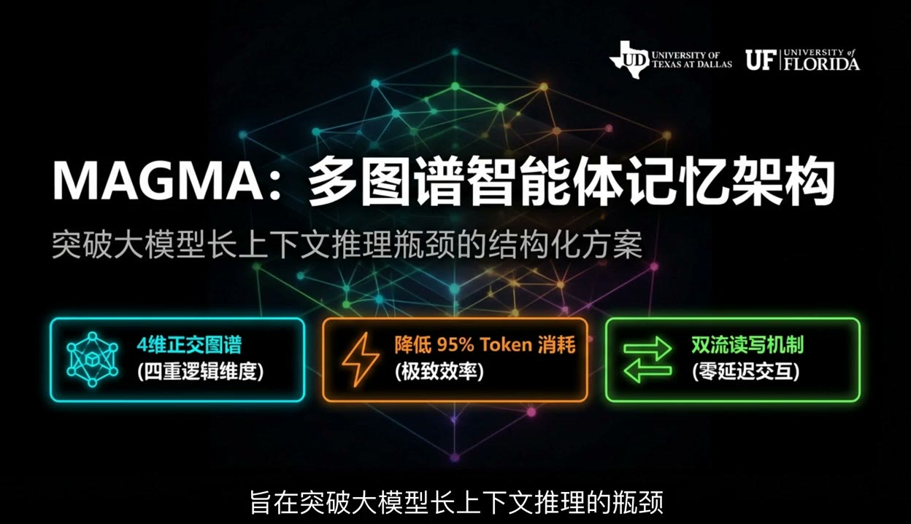
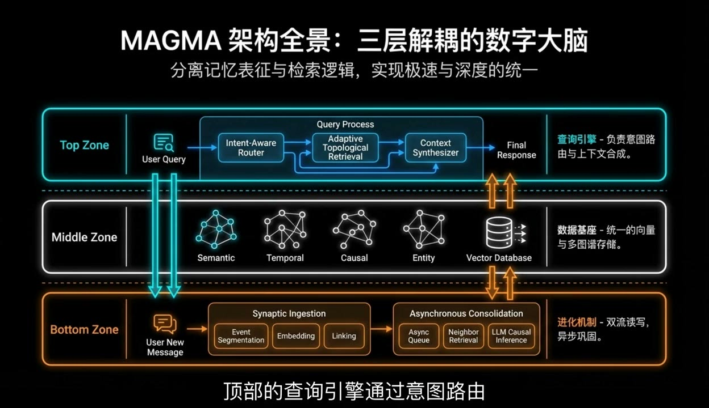
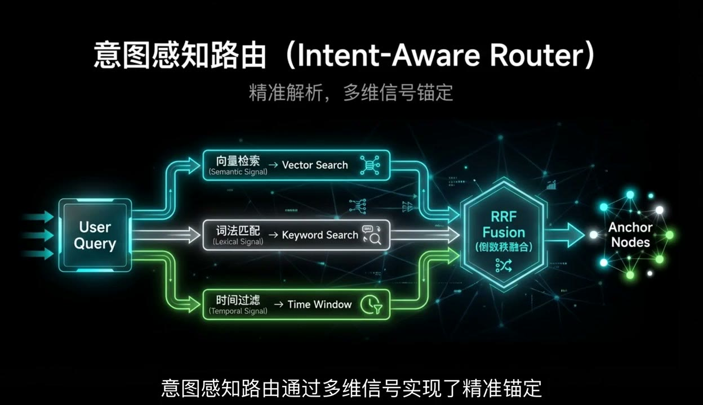
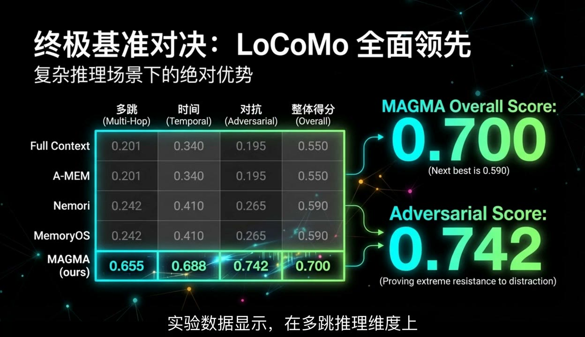

# MAGMA

MAGMA 是面向 OpenClaw 多 Agent 系统的跨会话、跨 Agent 记忆架构，全称为 Multi-Graph Adaptive Memory Architecture。

它负责把对话事件、实体、关系、向量、召回记录和反馈写入本地 SQLite + FAISS 记忆层，并通过 `magma-recall` OpenClaw 插件，在 Agent 构建提示词前自动注入相关记忆。



## 图解

### 1. 架构全景：三层解耦的记忆大脑



### 2. 意图感知路由：语义、关键词、时间信号融合



### 3. 基准效果：复杂推理场景下的稳定召回



## 当前运行态

- Embedding 模型：本地 `BAAI/bge-small-zh-v1.5`
- Embedding 维度：512
- 慢路径 LLM 后端：DeepSeek V3 via OpenRouter
- 主 API：`http://127.0.0.1:8902`
- MCP 服务：指向 8902 主 API 的薄代理

LLM 后端和 embedding 模型是两套东西，不能混用。DeepSeek V3 用于慢路径关系抽取、因果推断和记忆巩固；`bge-small-zh-v1.5` 用于本地语义向量召回。历史上的 MiniLM-L6-v2 / 384 维向量不是当前运行态。

## 可用性边界

这个仓库包含 MAGMA 的代码、OpenClaw 插件和运维脚本，但不包含任何本地运行数据。首次启动会创建一个空数据库；要看到真实召回效果，需要通过 API、MCP 或 OpenClaw 插件持续写入记忆。

开箱即用：

- FastAPI API 服务
- SQLite 表结构自动初始化
- 本地 embedding 编码
- 手动写入、查询、MCP 代理
- doctor / ops / governance 运维脚本

需要外部系统：

- OpenClaw 自动召回和自动抓取需要安装 `openclaw-plugin-magma-recall`
- 慢路径 LLM 巩固需要你自己配置可用的 LLM 后端
- 生产数据、FAISS 索引和备份不会随仓库发布

## 核心能力

- 对话前自动召回记忆
- Agent 回复后自动写入 L0 原始记忆
- 通过 `source_agent_id` 和 `department` 记录跨 Agent 来源
- 语义分数 + 中文关键词 + 生命周期权重的统一检索
- 召回反馈闭环和 importance 动态更新
- 运维锚点，确保关键系统事实稳定召回
- 红黄绿健康诊断
- 保守记忆治理：默认 dry-run，apply 只做软治理
- MCP 工具兼容，并统一走 8902 主链路

## 目录结构

```text
magma/
  api/
    server.py              # FastAPI 服务
    mcp_server.py          # MCP 薄代理
  graph/
    sqlite_store.py        # SQLite 图谱/记忆存储
  vector/
    encoder.py             # sentence-transformers 编码器
  backup.py
  entities.py
  search.py

openclaw-plugin-magma-recall/
  index.js                 # OpenClaw hook 插件
  openclaw.plugin.json
  package.json

scripts/
  magma_doctor.py          # 健康诊断
  magma_ops.py             # 状态检查和安全修复检查
  magma_governance.py      # dry-run / 软治理
  magma_recall_eval.py     # 召回质量评测
  migrate_source_agent.py  # 来源归因迁移
  seed_operational_anchors.py
  magma_cli.py

RUNBOOK.md
HANDOFF_OPENCLAW.md
起源.md
```

## 安装

```powershell
cd C:\openclaw-magma
python -m venv .venv
.\.venv\Scripts\Activate.ps1
pip install -r requirements.txt
```

如果 Hugging Face 访问慢或不可用，可以在首次加载模型前设置 `HF_ENDPOINT`。

可以参考 `.env.example` 配置端口、数据库路径、embedding 模型和后台任务间隔。

## 启动 API

```powershell
cd C:\openclaw-magma
python -m magma.api.server
```

默认监听 `127.0.0.1:8902`。首次启动会自动创建 `data/magma.db`，不需要手动初始化数据库。

启动后验证：

```powershell
Invoke-RestMethod http://127.0.0.1:8902/api/v1/health
python scripts\magma_doctor.py --quick
```

写入一条测试记忆：

```powershell
Invoke-RestMethod `
  -Method Post `
  -Uri http://127.0.0.1:8902/api/v1/nodes `
  -ContentType "application/json" `
  -Body '{"id":"demo:hello","label":"event","properties":{"content":"MAGMA demo memory","source":"demo","importance":0.5}}'
```

查询测试记忆：

```powershell
Invoke-RestMethod `
  -Method Post `
  -Uri http://127.0.0.1:8902/api/v1/query `
  -ContentType "application/json" `
  -Body '{"query":"demo memory","top_k":3}'
```

## OpenClaw 集成

OpenClaw 插件位于：

```text
openclaw-plugin-magma-recall/
```

示例配置：

```json
{
  "plugins": {
    "entries": {
      "magma-recall": {
        "path": "C:\\openclaw-magma\\openclaw-plugin-magma-recall",
        "config": {
          "enabled": true,
          "apiBaseUrl": "http://127.0.0.1:8902",
          "topK": 6,
          "timeoutMs": 12000,
          "scoreThreshold": 0.35,
          "magmaCwd": "C:\\openclaw-magma",
          "capture": {
            "enabled": true,
            "ttlDays": 180,
            "maxChars": 4000
          }
        },
        "hooks": {
          "allowConversationAccess": true
        }
      }
    }
  }
}
```

插件注册三个 hook：

- `before_prompt_build`：对话前自动召回并注入记忆
- `agent_end`：对话结束后自动抓取 L0 记忆，并做弱正反馈
- `before_message_write`：写入历史前剥离注入的记忆块，保持历史干净

MCP 入口仍然兼容：

```powershell
python -m magma.api.mcp_server
```

所有 MCP 工具都会代理到 `http://127.0.0.1:8902/api/v1/...`，不会再在 stdio 进程里直接加载 SQLite 和 embedding 模型。

## 运维命令

```powershell
# 健康检查
python scripts\magma_doctor.py --json

# 简短状态
python scripts\magma_ops.py status

# 安全修复检查
python scripts\magma_ops.py repair

# 记忆治理 dry-run
python scripts\magma_governance.py --dry-run --json

# 软治理 apply
python scripts\magma_governance.py --apply --json

# 召回质量评测
python scripts\magma_recall_eval.py

# Qwen3 embedding 旁路评估，不修改生产数据
python scripts\qwen_embedding_probe.py --model .\models\Qwen\Qwen3-Embedding-0___6B

# Qwen3 reranker 旁路评估，不接入实时召回
python scripts\qwen_reranker_probe.py --candidate-k 20 --top-k 6
```

## 召回质量策略

MAGMA 的实时召回链路默认保持轻量：

1. `BAAI/bge-small-zh-v1.5` 负责快速向量召回。
2. 中文关键词、生命周期、source agent、importance 和 current-state 信号做规则重排。
3. `ops_anchor`、`L1`、`current_state` 等高密度记忆在运维和架构类问题中优先。
4. L0 原始对话保留为证据，但不会轻易压过高密度记忆。

`Qwen3-Embedding-0.6B` 和 `Qwen3-Reranker-0.6B` 目前作为旁路评估工具使用。实测 CPU 环境下 reranker 对 top20 候选精排会达到数十秒级，不适合放进 `before_prompt_build` 实时链路；它更适合离线质量审计、慢路径治理和后续 L1 提炼评估。

## 数据安全

运行数据不会提交到 Git：

- `data/`
- `*.db`、`*.db-shm`、`*.db-wal`
- `*.index`
- `backups/`
- `models/`
- `logs/`
- `.env`

不要提交本地记忆数据库、FAISS 索引、OpenClaw 凭据、飞书密钥、OpenRouter/OpenAI key 或 token 文件。

## 许可证

MIT
